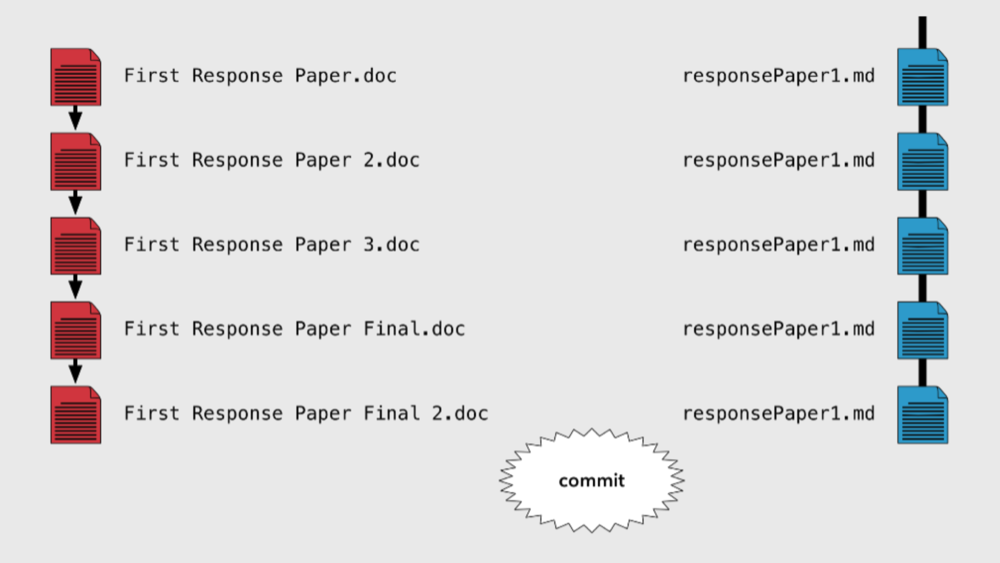
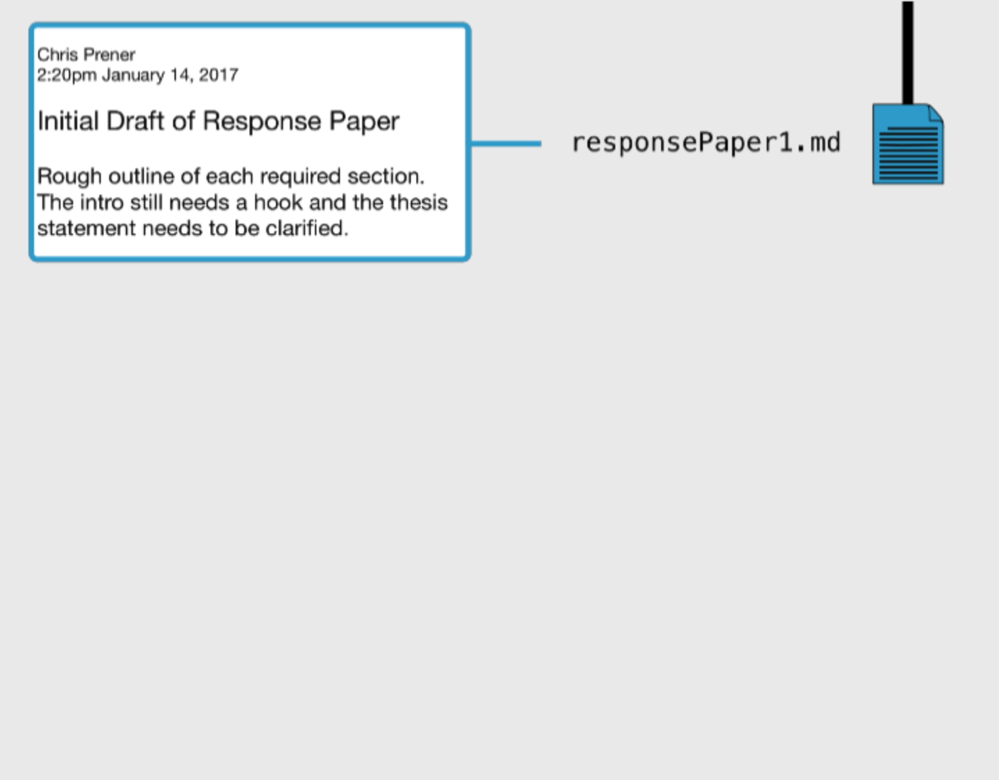
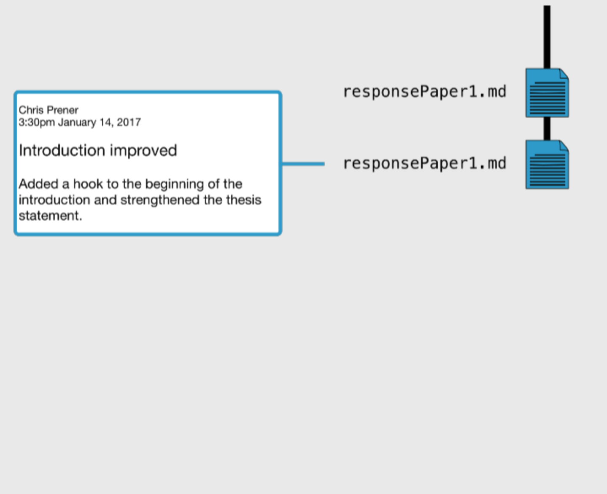
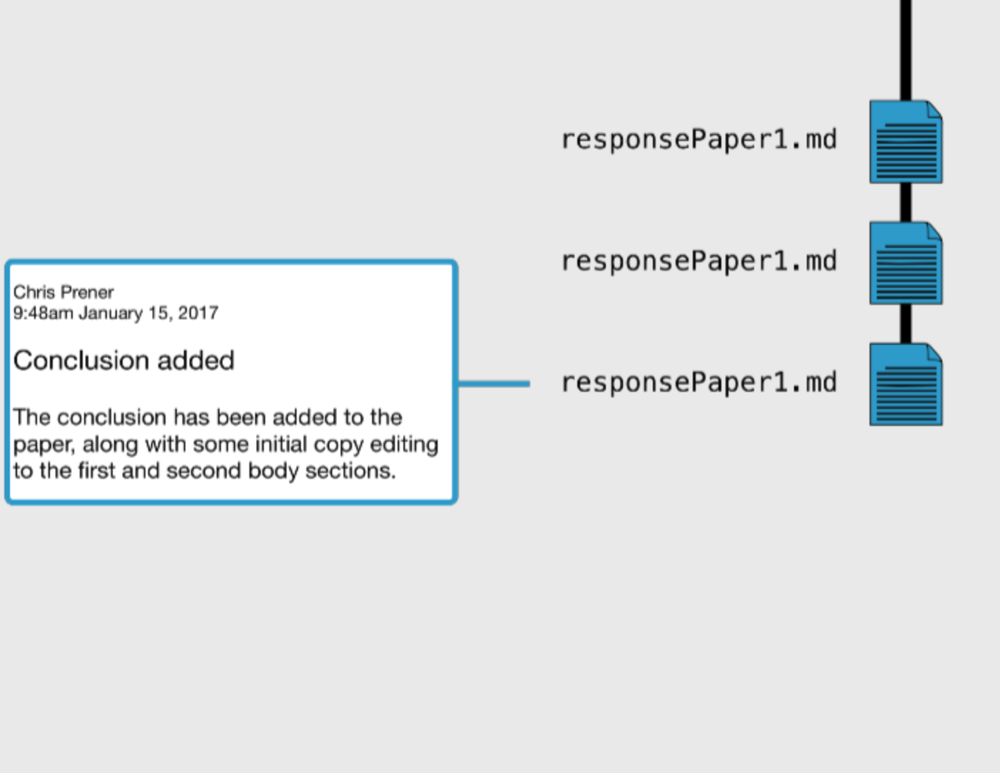
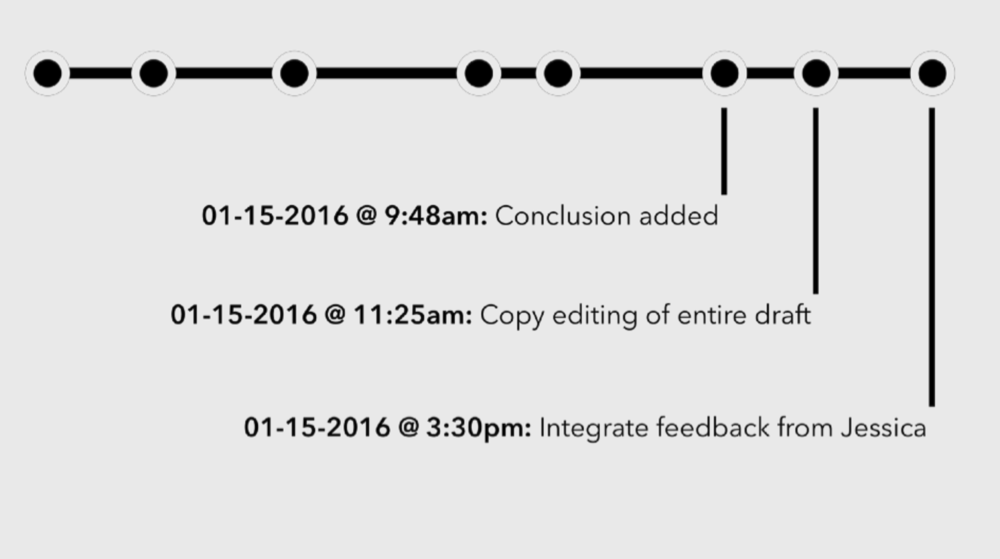
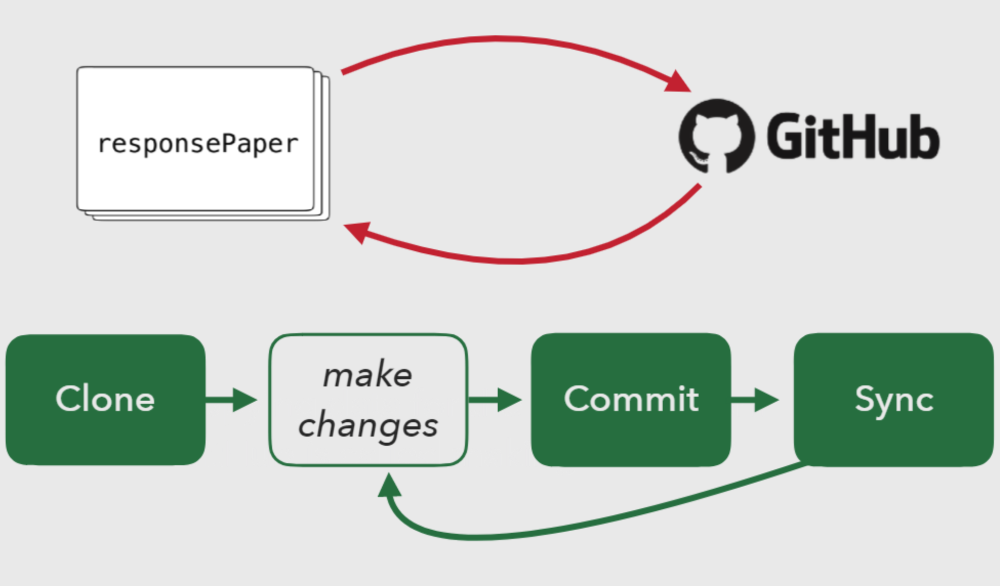

```{r setup, include=FALSE}
knitr::opts_chunk$set(echo = TRUE)
library(png)
library(knitr)

```

#Set Up 
- Go to https://github.com and make sure you are logged in
- Open RStudio 

```{r out.width= "90%", echo=FALSE}
include_graphics("volc.png")
```


# Agenda

1. Why Git and GitHub? 
2. Traditional Workflow vs. Git Workflow
3. Make a repository on GitHub
4. Make local changes in RStudio
5. Make remote changes on GitHub
6. Pull it all together!

# Key Questions
- How do you organize files?
- Do you keep different versions of files as your work progresses?
- Could you find your files in 5 years?
- Could you open them? 
- Do you backup your files? 

# Why Git and GitHub?

- **Git**: version control system
    - Manages the evolution of a set of files- called a **repository**
    - A **repository** is a top-level directory that has Git version control enabled
    - Think of it like an amped up "Track Changes"
    - Data scientists use for managing data, figures, reports, and source code

- **GitHub**: the hosting service for Git-based projects
    - Think of an amped up "DropBox"
    - Publicity and shareability
    - Collaboration
    
# The Typical Workflow vs. Git Workflow


```{r echo=FALSE}

```

- "Why the heck did I save all of these?"

- **Commits** are snapshots that are saved at particular points in time

- **Commit messages** require you to annotate your changes

# Git Workflow

```{r echo=FALSE}


```

```{r echo=FALSE}


```

```{r echo= FALSE}

```


# Git Workflow
```{r echo=FALSE}

```


# Git Workflow

```{r echo=FALSE}

```

# Let's Try! 

# Make a repo on GitHub

- Go to https://github.com and make sure you are logged in
- Click green **"`New Repository`"** button
- Fill this in: 
    + Repository name: **`volcanoRepo`** (whatever you want!)
    + Description: "This volcano repo contains some great volcano info" (*some text is good for the README*)
    + Public
    + YES - Initialize this repository with a README
- Accept defaults for everything else
- Click green **"`Create Repository`"** button
- Copy the HTTPS clone URL via the green **"`Clone or Download`"** button

#Clone the new GitHub repo to your computer via RStudio

- In RStudio, start a new Project: 
    + File > New Project > Version Control > Git. 
    + In "Repository URL", paste the URL of your new GitHub repo.
    + Accept default project directory name
    + Pay attention to where Project will be saved
    + Click "Create Project"

- Should now be in a new local RStudio Project that represents what we just created on GitHub including the **`README.md`** file

- Take a look around. Compare RStudio files and GitHub repo.

#Let's make some local changes!

- From RStudio, modify the **`README.md`** file by adding a line of text. 
    + i.e. "Seven volcanoes have permanent lava lakes".
- Save! 
- Commit these changes to your local repo from the terminal. How? 
- In the Rstudio Terminal: 
```{r}
# git add -A
# git commit -a -m "[commit message]"
  ##The commit message is your own annotation
  ##For example "Edited readme to include volcano info"
# git push origin master
```
   
- Go back to your browser and refresh
- We should see our new text included in the **`README`**.
- Click **`"Commits"`** to see your commit message history. 
- Cool, huh?


#Let's make some local changes in another way!

- From RStudio, make a new modification to the **`README.md`** file by adding a new line of text. 
    + i.e. These volcanoes include Erta Ale, Ambrym, Mount Yasur, Mount Erebus, Kilauea, Nyiragongo, and Masaya. 
- Save!
- Commit these changes to your local repo from the Git panel. How? 
    + Click the "Git" tab in the upper right pane
    + Check "Staged" box for any files whose modifications you want to commit
    + Click "Commit"
    + Type your commit message
    + Click "Commit" again
- Push local changes to GitHub
    + Click green "Push" button to send local changes to GitHub
- Refresh browser and confirm local changes propagated 

#Let's make remote changes from GitHub!
- From your browser, click on the **`README.md`** file
- Click on the pencil for "edit this file"
- Add a new line of text to this file
    + i.e. Mauna Loa is the largest volcano on Earth.
- Edit the commit message 
- Click the green **`"Commit Changes"`** button
- Back to **RStudio** 
    + Check out your **`README.md`**
    + Click the blue **`"Pull"`** button
    + Check out the **`README.md`** again

# Testing out RStudio
- From your browser, go to https://github.com/laurabrugger/volcanoRepo
- Click the green 'clone or download` button, and download to your desktop
- Move my repo inside your repo
-`Open`volcanoes.Rmd` file
- We'll switch over to the .rmd for instructions 

#Questions? 


# Contributors & References
- Chris Prener, PhD, Professor of Sociology, Saint Louis University
    + https://github.com/chris-prener
- https://happygitwithr.com
- https://education.github.com/
- laura.brugger37@gmail.com

# Appendix A: Set Up

- Register an account with GitHub
    + https://github.com 
- Install/update RStudio
- Install Git
    + https://git-scm.com/downloads 
- Introduce yourself to Git

```{r}
# install if needed (only do this once)
# install.packages ("usethis")

#library(usethis)
#use_git_config(user.name = "Jane Doe", user.email= "jane@example.org")

```
