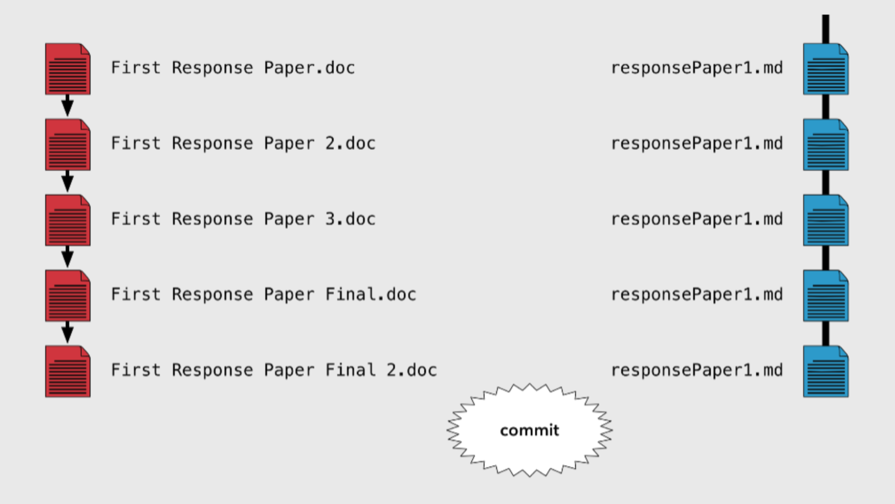

```{r setup, include=FALSE}
knitr::opts_chunk$set(echo = TRUE)
library(png)
library(knitr)

```

# Outline: Intro to Git and R

1. Why Git and GitHub? 
2. Git Workflow 
3. Benefits
4. Using RStudio and GitHub to: 
    * make a repository on GitHub
    * make local changes in RStudio
    * make remote changes on GitHub

# Key Questions
- How do you organize files?
- Do you keep different versions of files as your work progresses?
- Could you find your files in 5 years?
- Could you open them? 
- Do you backup files? 

# Why Git and GitHub?

- **Git**: version control system
    - manages the evolution of a set of files- called a **repository**
    - a **repository** is a top-level directory that has Git version control enabled
    - think of an amped up "Track Changes"
    - data scientists adopted for managing data, figures, reports, and source code

- **GitHub**: the hosting service for Git-based projects
    - think of an amped up "DropBox"
    - publicity and shareability
    - collaboration
    
# The Git Workflow
```{r echo=FALSE}


```

<center>


# What's the Payoff? 

# Make a repo on GitHub
- Go to *https://github.com* and make sure you are logged in
- Click green "New repository" button
- Fill this in: 
    + Repository name: `volcanoRepo` (whatever you want!)
    + Description: "This volcano repo contains some great volcano info" (*some text is good for the README*)
    + Public
    + YES - Initialize this repository with a README
- Accept defaults for everything else
- Click green **"Create repository"** button
- Copy the HTTPS clone URL via the green **"Clone or Download"** button

#Clone the new GitHub repo to your computer via RStudio

- In RStudio, start a new Project: 
    + File > New Project > Version Control > Git. 
    + In "Repository URL", paste the URL of your new GitHub repo.
    + Accept default project directory name
    + Pay attention to where Project will be saved
    + Click "Create Project"

- Should now be in a new local RStudio Project that represents what we just created on GitHub including the `README.md` file

#Let's make some local changes!

- From RStudio, modify the `README.md` file by adding the line "This is a line from RStudio".
- Save! 
- Commit these changes to your local repo. How? 
- In the Rstudio Terminal: 
```{r}
# git add -A
# git commit - m
# git push origin master
```
   
- Go back to your browser and refresh
- We should see our new "This is a line from RStudio" in the README.
- Click on "commits" to see one with your commit message. 
- Cool, eh?


#Let's make some local changes in another way!
- From RStudio, modify the `README.md` file by adding a line of text such as:*"Erta Ale, Ambrym, Mount Yasur, Mount Erebus, Kilauea, Nyiragongo, and Masaya are volcanoes with persistent lava lakes"*. Save!
- Commit these changes to your local repo. How? 
    + Click the "Git" tab in the upper right pane
    + Check "Staged" box for any files whose modifications you want to commit
    + Click "Commit"
    + Type a message in the "Commit message," such as "commit from RStudio- point and click style"
    + Click "Commit"
- Push local changes to GitHub
    + Click green "Push" button to send local changes to GitHub
- Refresh browser and confirm local changes propated to remote
Go back to your browser and refresh

#Changes on GitHub!
- From your browser, click on the README.md file
- Click on the pencil for "edit this file"
- Add a line to this file, such as "We can make edits from GitHub"
- Edit the commit message in "commit changes"
- Click the green "Commit changes" button
- Back to *RStudio* 
    + check out your README.md
    + Click the blue *Pull* button
    + Check out the README.md again

#Testing R Markdown

